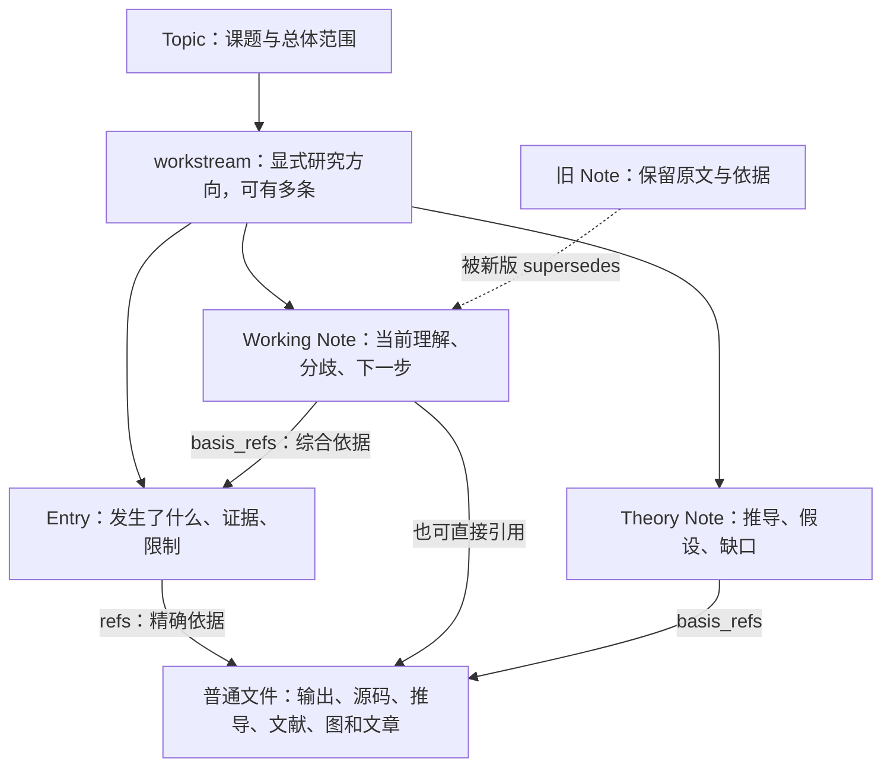
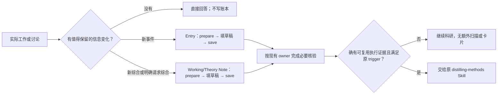

# 科研记忆：读懂现在，写清变化，保留推理

<a id="theory-history-refinement"></a>
## 理论／数值记忆指导修订（2026-09-10，源码更新）

吸收同日 domain-wall 探索及研究历史续篇反馈中的轻量写作建议：主 Skill
只保留短提示，现有 research-memory 参考补充正反例，不新增字段、状态机或
Skill。认识变化、解释收缩、有效的负面结果和旧路线理由写在现有正文；
`supersedes` 替代记录，不自动判旧结论全部错误。推导保留一个主要位置，
Entry 记有价值的变化，working Note 仅在综合真正变化或被请求时更新。
理论结果不是自动的方法卡；卡片触发、试验与人类批准仍由原 Skill 负责。

本次不修改 runtime、CLI、schema、保存校验、科研文件或旧反馈；0.9.0 与
adapter-contract-0.2 不变。小规模合成 CLI 回归验证解释收缩后的证据仍可
找回、原论证未被改写、读取零写入；已有 GW 恢复用例覆盖新失败与旧 handoff
并存。这些不是模型遵循、物理正确性、真实课题恢复或提速的验收。
安装和新会话行为复测尚未执行；不宣称历史完整，也不比较 plain files 优劣。

定向验证：research-memory、adapter-contract、distribution、method-card Skill
共 46 项通过（17.91 秒）；using-aitp Skill 校验及双方交接 diff 检查通过。
Skill 校验首次使用独立 Python 缺少 PyYAML，改用已有仓库虚拟环境后通过，
未安装依赖。主入口本轮仅增加 3 行，例子留在按需参考，不额外常驻注入。
完整 ledger 回归：197 项通过（45.46 秒），单进程运行。

安装跟进（2026-09-10 02:35 UTC）：用户随后授权重装；Codex 安装版本
`0.9.0+codex.20260910023532`，Hakimi 公开插件 install API 返回 enabled/ok、
diagnostics 为空。两端各 65 个源 bundle 文件逐字节一致，安装后 CLI help
成功。安装前完整列表 224 个会话均为空闲；没有启动科研任务或重启 daemon。
Codex 应使用新对话加载更新；以上源码阶段“未重装”状态现已被本次安装取代，
新会话行为复测仍未进行，不宣称当前对话已替换先前加载的 Skill。

## 当前效率切片（已安装，有限读写验收完成）

常用 using-aitp 主入口从684行缩为182行；保存/pin细节移至 recording.md，
完整CLI与低频bootstrap/backfill/transport规则移至 cli-contracts.md，按任务
读取而非常驻。科研综合说明仍在 research-memory.md。既有安全和科学边界不变。
独立读取可同批，依赖路径、prepare/edit/save及核验仍按依赖执行。完整检查
报告与退出码保留，模型先看计数和影响当前依据的具体finding；不得以截断后
未看见某项宣称它不存在。未知退出码/exit2仍停止依赖该投影。

基线与复测均显示模型往返与监督审批占主要耗时；正向写入仅在隔离合成fixture
验收，不往真实课题中造记录。以下不是因果提速或全面召回/行为一致性证明。

### 效率验收（2026-09-09，北京时间）

同样短问题、同一模型 openai-codex/gpt-6-astra，分别在全新 Hakimi 会话显式
读取安装 Skill 文件并调用 CLI；Research Mode 关闭，未改变隐藏 Skill 的策略。

| 指标 | 自旋链旧版→精简版首答 | Domain Walls旧版→精简版 |
|---|---:|---:|
| 模型请求 |12→8|13→9|
| 工具调用 |17→18|16→15|
| 总秒数 |253.293→172.155|130.751→151.227|
| 审批等待秒数 |122.923→65.116|16.997→56.377|
| 总时间减审批秒数 |130.370→107.039|113.754→94.850|
| 首token延迟+流式生成秒数 |118.437→94.972|111.441→92.997|
| 各请求输入token总和（包含缓存、重复上下文） |824599→316123|907357→460549|

自旋链首答恢复了有限L边界、受限搜索、未完成认证与当前关系，但没有清楚
区分“证明方向仍有效”和“Goal仍暂停”。监督要求定向读最新Entry完整正文后
明确纠正，增加15.822秒、2次模型请求、1次工具。包括纠正是10次模型请求，
不能把首答当作完全正确的无辅助验收。参考文档已补这个区别，补充文字的
广泛无辅助效果尚未测量。Domain Walls保留候选理论、物理探针/中性扇区和
SU(4)/SU(5)未决边界，并复用完整check日志读细节。两者均未为只读恢复写Note。

正向写入会话仅使用临时目录 /tmp/aitp-lean-write-tdQ7o766：公开prepare/save
产生1条synthetic observation与1张working Note；同key重试返回existing及
already_saved，Note basis精确pin Entry。fixture-a找到1Entry/1Note，fixture-b
0成员；作用域check退出0，全局退出1只含empty_topic_goal，未捏造human Goal
消除警告。全程15次模型请求、31次工具、532.277秒，其中341.996秒是监督
逐条审批等待；模型首token+生成182.958秒。此测试包含刻意的重试和负例查询，
不是单次save延迟，也没有写入性能基线，不宣称写入提速。

最终ledger191项通过（36.37秒），Skill校验、链接分发回归及diff检查通过。
Sep8 16:14:48 UTC完成最终插件reload，217个会话均空闲，65文件完全一致。
三项目974个既有canonical Markdown未变、无新增；三个新测试会话均mode
inactive/revision0、Goal/action/pending为空、无队列。未commit/push。
原始逐项计时、答案和隔离写入结果保留于Hakimi开发checkout私有目录
.tmp/aitp-lean-read-write-20260909/。这些输入总量不是唯一上下文大小；工具、
审批与模型区间可能重叠，不能机械相加作精确耗时分解。

下一最小优化候选是Hakimi只读审批/报告呈现的独立审查，不是给AITP新增
状态机或取消验证。本切片未改Hakimi权限、自动批处理、runtime或冻结CLI。

本切片优化 AITP 的可安装 Skill、Note 模板提示和使用说明，不新增 schema、
CLI、索引或状态机。下图中的“问题、猜想、论证”是已有正文所表达的科研内容，
不是新增数据库实体。Goal continuation、Research Action、Board 仍由 Hakimi
负责；本切片不改变它们，也不能据此声称真实会话已经自动、顺畅地执行。

## 1. 最后读到的应该是什么

研究者问“这条线做到哪里了”，回答应该先讲：

> 正在回答哪个问题；目前有哪些有条件的结论；最近什么证据改变了理解；
> 还不能排除什么；下一步最值得做什么。

每个重要判断能点回原记录和相应推导、输出或文献。版本、哈希和维护信息保留
在证据层；只有它们影响当前判断时才提到前面。不能藏起影响当前依据的错误，
也不能把其他线的 warning 列表当作当前科学结论。

这是按需阅读后形成的回答，不是另一个需要持续同步的 `STATUS.md` 或 registry。
完整的操作指导随插件安装在
[`using-aitp/references/research-memory.md`](../plugins/aitp-research-protocol/skills/using-aitp/references/research-memory.md)。

## 2. 三种关系不要混在一起

### Topic 地图与详细文档：本轮补充

`TOPIC.md` 用现有章节说明总体问题、方向边界、共享约定和阅读入口，不另造
索引或逐条列出记录。入口可以指向带日期的综合 Note，但“现在怎样”仍须按
显式 workstream 恢复；旧导航不能覆盖新 Note，也不能自动把相似 slug 当别名。
只有方向、共同约定、重要位置实质变化或用户要求时更新地图，不随每条 Entry 重写。

详细推导按依赖顺序解释假设、关键步骤和缺口，区分恒等式、近似、数值观察与
猜想。长 TeX/Markdown 稿件留在原目录；Theory Note 提供关键论证和精确章节入口，
用既有 basis_refs 固定所依赖版本，不复制全文。普通编辑不必每次产生 Note。

CLI 裁决：当前没有 Topic-update 或 Note-show。先使用现有文件读取与有授权的
普通 Topic 编辑；这里未实现新的命令。若将来需要受支持的 Topic 更新接口，需先
冻结身份保留、并发比较与零写失败语义，再同步 contract/tests；这是 planned /
unavailable，而非此次新增。Note 统一读取入口也先保留为候选，现有精确路径读取
已可完成任务。任何此前更严格的 canonical 写入限制仍须用户明确解除。

本轮已补按需 Skill 指导与旧导航/显式归属回归，190 项 ledger 测试通过；
14:46 UTC 已本地安装并核对全部 63 文件。随后用户明确授权 Topic 文件例外，
已更新真实 GW 的 Scope、Important Locations、Must Read；身份、原 Research
Goal 和其他章节保留。974 个既有 canonical Markdown 中仅该 Topic 改变，
其他973个字节不变、无新增记录；完整 check 前后报告逐字相同。
四条 scope 的公开 enter 仍返回各自的原综合入口。新的只读
导航会话在提供入口后找回了两条 QSGW 线各自的历史结论与综合入口，保留
producer 验收不等于 QSGW 收敛等边界；一次 check、零写入。自动入口发现
未通过。另一全新会话恢复了固定 AO 相位失配修正的推导、反例与适用边界，
并在随后明确允许必要综合写入的条件下选择零写入：现有 Note 已完整覆盖。
该测试不证明新模板的正向 save。推导恢复14工具调用、一次 scoped check；
耗时256.881秒，其中监督审批等待171.254秒，其余85.627秒混合模型/网络/工具
与调度成本，不是因果提速证据。下面的历史验收不能代替本轮验收。

本轮真实入口探测发现：Hakimi 关闭 Research Mode 时会隐藏此插件的 Skills，
显式调用 `Skill(using-aitp)` 也被拒绝；普通 PATH 没有 `aitp` 命令。新会话因此
未完成自主导航恢复。提供安装位置后通过普通文件读取和 Python CLI 的验收属于
辅助入口测试，不能声称自动发现成功。这是 Hakimi Skill 可见性设计的限制，
不是 AITP 记录 schema 缺失；更改该策略属于当前只改伴随文档范围之外的候选。



| 需要表达的事 | 放在哪里 | 不能误解为 |
|---|---|---|
| 这份记录属于哪条线 | Topic、显式 `workstreams` | 同一 LibRPA checkout 就是同一课题；引用即归属 |
| 哪条证据支持/反对哪个解释 | `refs` / `basis_refs` 加正文中的对应论证、条件和 locator | 有 pin 就证明结论正确；引用次数就是独立实验数 |
| 理解怎样变化 | 新记录的 `supersedes`、新旧正文的差异说明 | 编辑旧记录，或删掉失败历史 |
| 哪个失败已经解决 | 新 Entry 的直接证据及 `resolves` | 编译成功、重跑完成、卡片存在，就算物理问题解决 |

AITP 的 workstreams 是显式成员列表，不是自动推导的层级树。一个明确共同的
事件可以属于多条线；多条线也可以各自引用同一个构建报告而不复制报告。
共享 binary 的正确性不等于 Si、NiO、Bi₂Se₃ 各自计算的正确性。

科研文件不搬进账本：TeX 推导和 paper 仍放原研究目录；Note 综合其论证，
Entry 记录真正发生的结果或修改。选择不可变副本、Git revision 或适当生命周期
的 pin，复用已有有效依据，不为每次读取重新封装全套 provenance。

## 3. 读取：综述不是唯一事实，最新也不一定相关


实际命令仍然是 `enter --workstream`、`list --workstream --since`、`show` 和
定向 `rg`。这里的箭头是阅读思路，不要求每次把所有命令再运行一遍：

- host 已提供 fresh、同 scope 的维护结果，就复用；仅缺 Note locator 时按需读。
- `latest_working_note.source` 指向确切文件；Notes 直接读取，`list/show` 只返回 Entries。
- `--since` 按记录时间筛选，不能证明 Note 已覆盖更早材料；仍需按问题找遗漏依据。
- `enter.next_action` 保留现有 closeout-first 规则。旧 closeout 与新失败并存时，
  要讲清差异，不照旧 handoff 盲目执行，也不改排序来冒充语义判断。
- 没有 scoped Note 时，可从相关 Entries 恢复，不先强制写一张 Note 才允许回答。
- 新结果不会自动解除人类暂停、确认 Goal 归属或决定另一条研究线开始工作。

真实冷启动测试还暴露了一种关系误读：旧 resolver 虽有 `resolves`，但自身已经
被替代；其 active 后继没有这条边。因此失败仍显示 unresolved 是现有投影的
正确结果，不是 runtime bug。读取时通过 canonical `show` 核对当前 status 和
后继关系，把“历史上记过修复”与“当前有效关闭关系”分开；不自动补边消除提示。

效率上，普通状态查询不重建整个课题史；全课题恢复先分清显式方向，再按缺口
深入。当前 `check` 报告与已读依据可供本会话复用，不为计数、详情和另一段回答
重复调用。同 scope 检查也会扫描全库，不要把逐线循环检查当成快速目录查询。
这些指导不省略原有 session/save 边界核验，实际提速仍需独立新会话复测。
草稿审阅关注内容、归属、引用，正式验证由公开 save 完成，不为预检临时安装
YAML 依赖或另造正则 validator。保存的 Note 不留下“等待本草稿保存”的操作
提示作为科研下一步，也不因监督检查就改变 `agent_draft`。

## 4. 写入：按信息价值选载体

| 场景 | 该做什么 |
|---|---|
| “看看作业怎么样”，状态没有实质变化 | 直接回答；沿用已有作业身份；零写入 |
| 获得新输出、发现重要错误或验证一个猜想 | 一个适当类型的 Entry，写清实际观察、依据、限制 |
| 人类提出建议 | 保留出处与假设地位；有实质方向决定时记 decision；验证另记，不冒充已证实 |
| 多个结果让解释发生改变 | Working Note 综合：为什么改、什么仍成立、什么未知 |
| 推导进行到一个值得保留的节点，但尚未闭合 | Theory Note 或普通推导草稿，明确缺失步骤，不装作定理 |
| 阶段成果值得写成文章 | 在普通研究目录写 note/paper，以已有证据建立论证；AITP 记录必要依据与状态 |
| 实际重复出现可复用方法/关键失败 workaround | 仅对本次证据条件性进入 `distilling-methods`，不每轮造卡 |

Working Note 的现有七节分别承担：问题、覆盖范围、当前解释、证据对应、
不确定性、未解决问题、下一步。Theory Note 的现有六节承载完整或明确未完成的
论证。模板提示现在强调“证据支持了什么”和“例子检验不等于一般证明”。
不另加必填字段或固定的研究步骤清单。



这不是每轮写 Entry 再写 Note 再写卡片的流水线。未变化查询零写入；已有 Note
已覆盖就引用；只请求综合已有结果，不为宣布 Note 另造一个 result。
卡片使用现有 theory Note profile；正式 trigger、basis/trial 区别、exact trial、
修订、两步人类决定和发布规则只在原 Skill 中定义，不在这里复制一套。

## 5. 三个真实需求对应的验收场景

以下是从实际记录结构抽出的简化情景，回归数据是人工构造的小样本，不是新的
物理实验或真实会话回放，也不证明模型已经自主遵循指导。

1. **Si/GW：旧 handoff 与新失败。** 旧综述在等作业，新 Entry 已报告失败，
   同 Topic 还有 NiO 的较新 Note。读取必须保留旧 handoff 的出处，同时找到
   Si 的 Note 和新失败，不能拿 NiO Note 冒充 Si 状态；查询本身不写账本。
2. **Heisenberg：局部推导修正。** 既有人类暂停，新证据修正一个代数步骤。
   记录修正的依据与适用范围，保留旧版本和暂停决定；小矩阵反例不能当作
   一般系统的可积性结论；原先没有 Working Note 也能读取相关 Entry。
3. **Domain walls：论证逐渐清楚。** 从候选构造走到明确的缺失映射，用新
   Working Note 引用结果和推导并 supersede 旧综合；不复制整篇稿件，不把
   编译通过当作物理唯一性证明，不把 Note 修订当作卡片 trial。

验收使用隔离临时 store，通过真实 CLI prepare/save/read/check 验证作用域、
幂等重试、证据 pins、原文保留、Note 修订和纯读取零写入。原科研目录只读。

## 6. 实现边界

- 本切片可交付的是安装源中的读写指导、模板提示和确定性测试，不是自动摘要
  runtime，也不是新的科研执行许可系统。
- `record save` 的 exact Topic/workstream 原子比较仍然只适用于 Entry；Note
  没有此 CLI 变体，不能因新增指南就对外宣称有同等原子保证。
- M2 reviewed artifacts、M3 cross-topic links/catalog、M4 collaborator protocol
  仍是 planned / unavailable；没有恢复 deferred 的 structured prepare/lineage。
- 大文件 pin 校验的内存优化、Hakimi 普通查询捷径、Board、长期真实会话验收
  是独立后续切片，不把这次文档/测试通过写成这些问题都已解决。
- 未发布或重装本切片前，已运行的会话不会自动得到新指导。

## 7. 本切片验收与修改范围（2026-09-08）

验收命令与结果：

```text
.venv/bin/python -m pytest -q -p no:cacheprovider tests/ledger
187 passed in 32.78s
```

其中包括原有账本、CLI/help、golden fixtures、原子 Entry 保存、Method-card
规则回归，以及新增的三个真实需求抽象场景与一个 bundle 指南可达性检查。
`skill-creator/scripts/quick_validate.py` 检查 using-aitp 通过；双方
`git diff --check` 通过。没有另跑 Hakimi REST/WS/SDK/klient/TUI/Web 测试：
本切片在 Hakimi 仅同步文档，不声称客户端或安装验收。

相对开始时的 dirty 工作树，本轮修改 AITP 9 个已有文件、新增 4 个文件：

- `README.md`、本文 `docs/research-memory.zh-CN.md`（新增）；
- `plugins/aitp-research-protocol/skills/using-aitp/SKILL.md` 及其
  `references/research-memory.md`（新增）；
- `plugins/aitp-research-protocol/scripts/vendor/aitp/resources/templates/note/`
  下 `working.md`、`theory.md`（仅提示语，固定标题不变）；
- `plugins/aitp-research-protocol/aitp.contract.json`（仅现有 description）；
- `tests/ledger/test_adapter_contract.py`、`tests/ledger/test_research_memory.py`（新增）；
- `feedback/README.md`、
  `feedback/2026-09-08-research-memory-read-write-natural-use.md`（新增）；
- `docs/hakimi/README.md`、`docs/hakimi/compatibility-matrix.md`。

Hakimi 当前开发 worktree 仅在以下五份文档增加对应交接段落：`README.md`、
`README.zh-CN.md`、`docs/aitp/README.md`、`docs/aitp/TRACKING.md`、
`docs/aitp/compatibility-matrix.md`。没有修改其 runtime、会话或构建产物。
AITP runtime Python 文件、已有 golden fixtures 和 distilling-methods 原文保持
本轮开始时的字节；已有 0.9.0/S5.1 未提交实现不被回退。未 commit、push 或重装。

## 8. 本地交付与真实会话复核（2026-09-08）

本节是 §7 之后的交付结果，不改写上次未安装的历史事实。目标是在原 Si
Hakimi 会话验收“恢复同线已有理解 → 必要综合 → 保留来源关系”，不启动新
计算、不恢复科研 Goal、不改变研究归属，也不把验收请求伪装成新实验。

- 审查安装源与旧 bundle：仅指南、两份 Note 模板提示和既有 contract 描述有差异，
  Python runtime 相同。通过既有插件安装 API 完成本地重装和 reload；安装前
  198 个已列出会话均空闲，安装后 62 个非缓存 bundle 文件与源码一致。
- 原 Si 会话使用 `openai-relay/gpt-5.6-sol`，实际加载 using-aitp 和新 reference，
  定向读取旧 Working Note 与六条 canonical Entries，识别较新的同线记录，
  更新当前 Question，并通过 `note prepare → 编辑 draft → note save` 保存一个
  agent_draft Working Note，以 supersedes 保留旧综合。没有新 Entry、card 或 trial。
- 三个研究工作区的 969 个既有 canonical 文件全部保持原字节，仅新增上述 Note。
  其他四个被观察会话的科研字段不变；全部 Goal、归属、人类决定和 committed
  history 不变。Si 的 Goal 仍是原有 blocked，未被本次验收恢复。
- 完整 ledger 测试本次重跑 **187 passed in 34.51s**。这是原会话一次受监督的
  读写观察，不是无人干预 conformance、性能对照、科学结果或跨课题全程验收。

尚未通过的部分必须保留：

1. **说明读取的多余门禁（Hakimi）**：无 active action 时，读取安装包内的新
   Skill reference 被拒绝；模型开启 action 后恢复。使用说明不应和新的科研
   执行混为一类，但不能由此放开任意 Read/Bash。
2. **revision 易混淆（Hakimi）**：模型曾把 snapshot revision 用于 Question 更新，
   被拒绝后用 Question 自身 revision 重试成功；不能算零摩擦流程。
3. **综合引用不充分（AITP 使用质量）**：新 Note 固定了提交凭证，并文字限定
   状态来自已存观察，但没有精确固定承载最新状态陈述的 canonical Entries。
   凭证证明作业身份，不证明任务的终态；需要按已有 refs/supersedes 规则补正。
   原 Entry 若也未固定原始查询输出，这一证据限制仍须明示，不能靠多一个 pin 消除。
4. **外部模型服务失败**：Note 保存后，relay 连续四次返回 server_error。
   已停止本次请求的自动重试并取消尚未执行的引用补正请求；未打断科学计算，
   未留下本次新增的 live action、pending checkpoint 或排队请求。

因此本次结论是：**安装和 scoped 读写通路已实测；自主高质量综合尚未验收通过。**
唯一下一步是 relay 恢复后，让原会话仅补正新 Note 对 canonical Entries 的精确
引用和证据限制，用新 Note supersedes，旧 Note 不动；不为此创建新 schema/CLI。
Hakimi 两处交互摩擦分别记录为后续小切片，不在此次安装中声称修复。

本次代码仓库只同步本文、两侧 README/handoff 与自然使用反馈，未修改 runtime，
未重建 Hakimi CLI、未重启服务器、未 commit 或 push。私有验收明细留在 Hakimi
开发 worktree 的 `.tmp/research-memory-acceptance-20260908.md`；不会将真实科研
会话内容复制成公开 fixtures。

## 9. mode-off 冷启动后续：修复综合，再独立复测

第8节保留当时观察。之后在五个全新 Hakimi 会话关闭 Research Mode 读取了
Si、NiO、Bi2Se3、Heisenberg、Domain Walls，没有让原会话继续科研。Si 引用
另经新综合修正；NiO 与 Bi2Se3 则确认旧 Working Note 已落后于数值/终态记录。
用户授权后，新测试会话通过公开 prepare/save 各追加一份同 scope 的 Working
Note，分别保留13/15项 exact basis refs、旧 agent Note 的 supersedes 与科学
限制。三个研究目录原有971份 canonical Markdown 字节未改；保存后可按对应
scope 找回新Note，旧findings未增加，没有新Entry、failure闭合或人类决定。

Heisenberg 的 resolver 误读由当前 status/后继关系纠正，不改变运行时；无Note
不等于无记忆，已有Entries可恢复的其他缺口不因UI提示强制造记录。Domain
Walls 的当前综合已保留候选/物理实现缺口，卡内旧trial时态不等于自动发布资格。

本轮又减少两类无益工作：同会话重复读取/检查的指导，以及临时另写草稿
validator（真实草稿曾因缺少yaml依赖失败后重试）。正式验证继续由公开save
执行，session/save边界检查与distilling-methods规则不变。

189项ledger测试全部通过（单worker，34.77秒）；Skill与diff检查通过。
2026-09-08 13:12 UTC 确认203个会话idle后，经现有插件API重装/reload，63个
安装文件与源包一致；不重建Hakimi、不重启服务。版本0.9.0/contract-0.2未变，
改变的是指导和已有命令描述，无CLI/schema/runtime变更。

另一组五个全新mode-off会话已完成同模型、同请求复测。NiO/Bi2Se3均找回新
综合并保留物理限制；Heisenberg分清八个方向、有限尺寸证书和未完成部分；
Domain Walls保留候选构造与物理实现间的缺口。首轮Si遗漏新请求的一个关键
配置限制，因此不能按“更快”算完整通过。随后Hakimi公开追加第三份Si综合，
保留9项exact basis refs，明确当前配置、旧对照、producer来源和终态陈述的
区别；旧971文件仍未改，无新增findings。进一步独立Si冷启动已找回这三个边界：
实际refresh=false不等于旧ON；新dataset不继承r18验收；历史终态陈述不等于
当前远端状态。第二轮非审批188秒、24次工具调用、3次CLI check；没有给新
会话提供记录ID或答案，仍使用原请求。初轮遗漏保留在验收报告，不被覆盖。

另一个全新Heisenberg定向只读会话没有收到记录ID或正确答案，自行找到三条
修稿关系链，正确区分：active后继显式保留resolves的两项关闭，以及后继未保留
该关系的一项未关闭。还纠正了提问中“正文没写完”和“稿件公式/范围有误”
不能混为同一failure的前提。未补resolves，未重验科学稿件，不是全历史召回证明。

| 方向 | 基线 / 复测非审批秒数 | 工具数 | CLI check次数 |
|---|---:|---:|---:|
| Si（首轮，覆盖不全） | 233 / 181 | 26 / 27 | 2 / 2 |
| NiO | 237 / 246 | 23 / 21 | 3 / 2 |
| Bi2Se3 | 281 / 181 | 26 / 22 | 3 / 3 |
| Heisenberg | 292 / 248 | 23 / 24 | 2 / 1 |
| Domain Walls | 252 / 229 | 25 / 37 | 3 / 3 |

原始总耗时包含大量审批等待；表中从原生日志扣除审批请求至解决的区间并集，
剩余仍包含模型、网络、工具和调度。NiO略慢、Domain Walls工具更多，不能隐去。
这是单次便利样本，不是受控因果实验；没有100%召回、自主科研或行为优越性保证。
五个首轮复测期间973份canonical文件无变更/新增；第三份Si维护是另行授权的
写入，不混入只读测试。普通只读问答仍零写入，不因缺Note自动造卡/决策。

收尾时所有本轮新测试会话空闲，mode inactive、revision0、Goal/action/pending
checkpoint均无，未改原科研会话或远端任务。最终974份canonical文件中只有
上述3份获授权的新Note；全套189项测试最终重跑35.58秒通过，Skill与两侧diff
检查通过。完成的是这个有限的修复/复测闭环，不是所有旧记录的穷尽修复或
Research Mode harness改造；M2/M3/M4、自动科学判断和保证全历史召回仍未实现。
